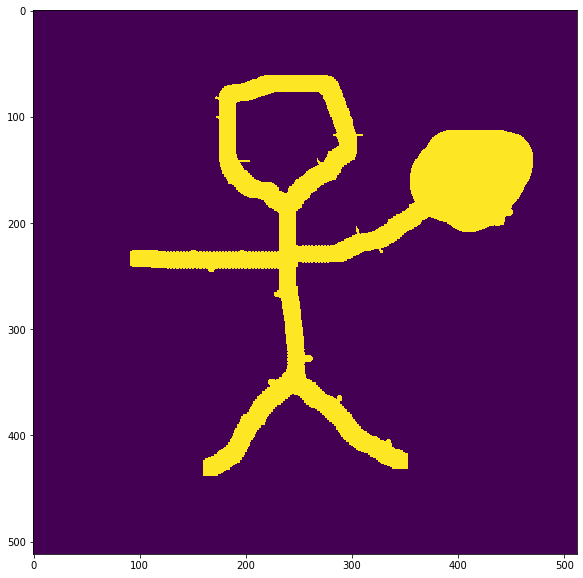
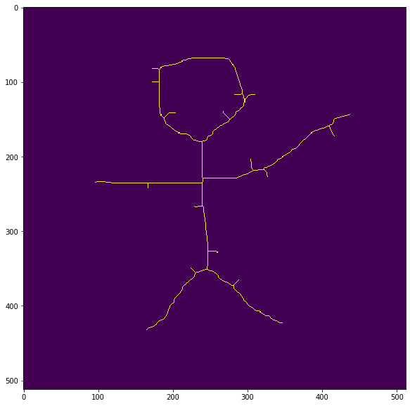
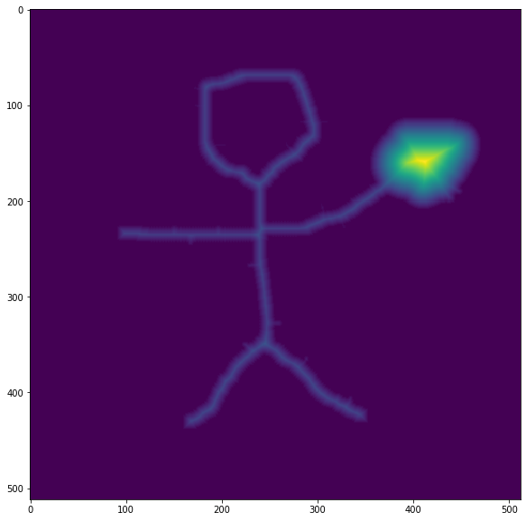
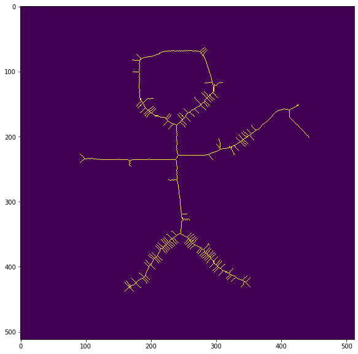
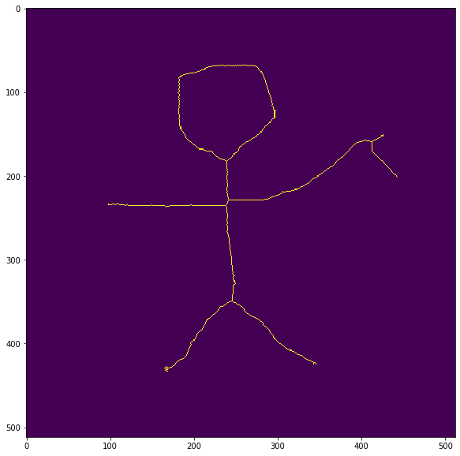

# DSE
Python implementation of discrete skeleton evolution, a skeleton pruning algorithm 
http://citeseerx.ist.psu.edu/viewdoc/download?doi=10.1.1.79.8377&rep=rep1&type=pdf


Setup
```  
pip install -e .
```


[Example](example/example.ipynb)
This algorithm filters out branches by evalutating their reconstruction weights. Original paper measures the weights by calculating the ratio of reconstruction pixel loss to whole reconstruction pixel, here the weights are simply the reconstruction pixel loss. 


```python
from dsepruning import skel_pruning_DSE
import numpy as np
from skimage.io import imread
from skimage.morphology import medial_axis, skeletonize
from scipy.ndimage import distance_transform_edt
import matplotlib
import matplotlib.pyplot as plt
```


```python
matplotlib.rcParams['figure.figsize'] = [10, 10]
```


```python
mask = imread('img/skel.png')
mask = mask > 0
plt.imshow(mask)
plt.show()
```





```python
skel = skeletonize(mask)
print("Show skeleton by skeletonize:")
plt.imshow(skel);plt.show()
dist = distance_transform_edt(mask, return_indices=False, return_distances=True)
print("Show distance map:")
plt.imshow(dist);plt.show()
new_skel = skel_pruning_DSE(skel, dist, 100)
print("Show pruned skeleton")
plt.imshow(new_skel);plt.show()
```

    Show skeleton by skeletonize:





    Show distance map:





    Show pruned skeleton


```python
skel, dist = medial_axis(mask, return_distance=True)
print("Show skeleton by skeletonize:")
plt.imshow(skel);plt.show()
print("Show distance map:")
plt.imshow(dist);plt.show()
new_skel = skel_pruning_DSE(skel, dist, 100)
print("Show pruned skeleton")
plt.imshow(new_skel);plt.show()
```

    Show skeleton by medial_axis:





    Show distance map:


    Show pruned skeleton




